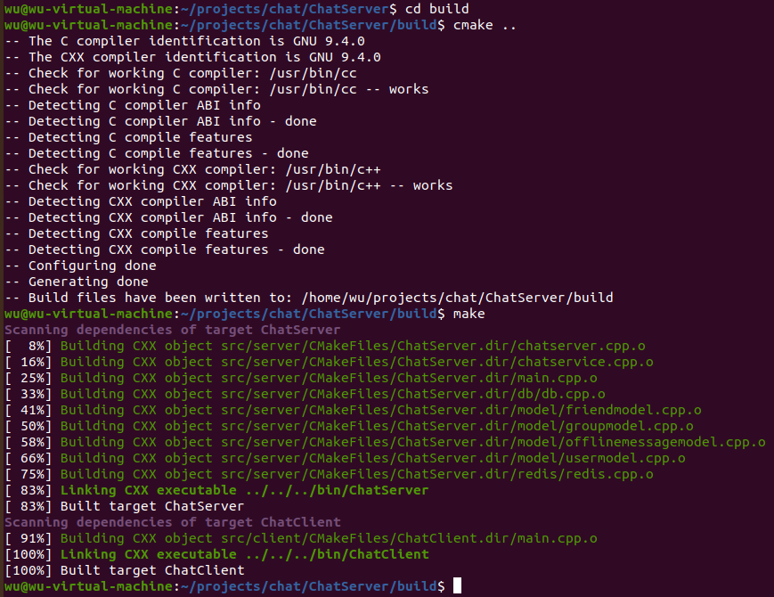

# ChatServer

ChatServer 是一个基于 muduo 网络库实现的服务器和客户端的源码。它具有以下特点：

- **负载均衡配置：** 使用 Nginx 基于 TCP 的负载均衡功能，实现了聊天服务器的集群功能，有效提高了后端服务的并发能力。
- **数据存储：** 使用 MySQL 关系型数据库作为项目数据的落地存储，确保数据的持久性和一致性。
- **跨服务器通信：** 基于 Redis 的发布-订阅功能，实现了服务器之间的消息通信，使得 ChatServer 可以在集群中实现实时消息传递。
- **通信协议：** 使用 JSON 序列化和反序列化作为私有化通信协议，确保通信数据的可读性和稳定性。

## 编译方式

```bash
cd build
rm -rf *
cmake ..
make

编译完成后，你将看到类似下面的示例图：


## 注意

在运行 ChatServer 之前，请确保以下服务已启动：

- **Nginx TCP 负载均衡：** 项目配置了 Nginx 作为 TCP 负载均衡器，请确保 Nginx 服务已正确配置并运行。
- **Redis 服务：** 项目使用 Redis 实现跨服务器的消息通信功能，请确保 Redis 服务已启动。
- **MySQL 服务：** 数据将落地到 MySQL 关系型数据库中，请确保 MySQL 服务已启动并可供访问。
